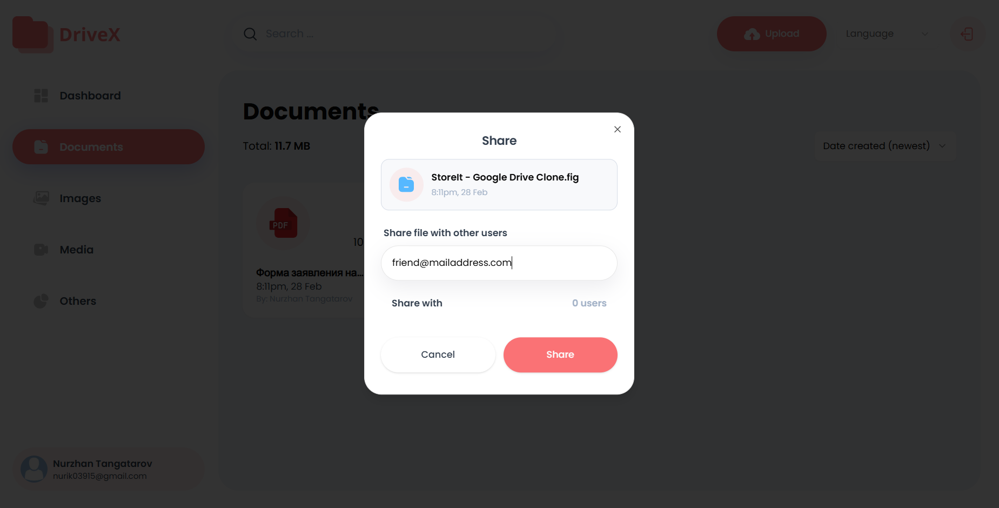

<p align="center">
  
</p>

# DriveX - File Storage and Sharing Platform


**DriveX** is a modern web application that allows users to upload, store, and share their files easily and securely. The platform is built using **Next.js** and leverages powerful backend services from **Appwrite** for file storage and management. It is designed with an intuitive UI using **ShadCN components** and focuses on performance, ease of use, and security.

## Key Features
- **File Uploading**: Easily upload and manage files in different formats.
- **Secure Storage**: Files are securely stored using **Appwrite**, ensuring data protection and privacy.
- **File Sharing**: Share files with others using simple sharing options.
- **File Preview**: Preview your files directly within the app.
- **Responsive Design**: Optimized for all devices, ensuring great usability across desktops, tablets, and mobile devices.

## Tech Stack
- **Frontend**: 
  - **Next.js**: Server-side rendering, static site generation, and client-side routing.
  - **ShadCN**: UI components library for building a sleek and responsive interface.
  - **TailwindCSS**: Utility-first CSS framework for fast UI styling.
- **Backend**: 
  - **Appwrite**: File storage, authentication, and database services.
- **Database**: Managed by **Appwrite**.
- **File Handling**: Using **react-dropzone** for efficient drag-and-drop file uploads.

## Installation
1. Clone the repository:
   ```bash
   git clone https://github.com/NurzhanTng/DriveX.git
   ```

2. Install dependencies:
   ```bash
   npm install
   ```

3. Run the development server:
   ```bash
   npm run dev
   ```

4. Open your browser and visit:
   ```
   http://localhost:3000
   ```

## Screenshots

Here are some images from the project:


*Upload Files Interface*


*File Sharing Example*


## Links
- [Русская версия README.md](./README.ru.md)

---

**DriveX** is open-source and free to use. Contributions are always welcome! If you find any issues or have ideas for new features, please feel free to create an issue or submit a pull request.

