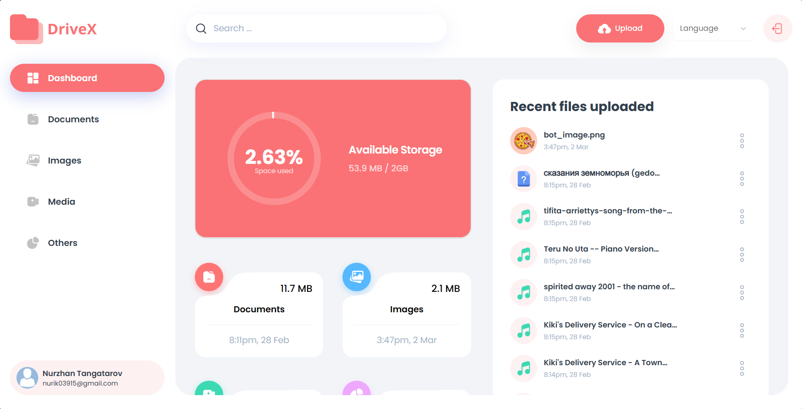

  

# DriveX - Платформа для хранения и обмена файлами

**DriveX** — это современное веб-приложение, которое позволяет пользователям легко загружать, хранить и делиться файлами. Платформа построена с использованием **Next.js** и использует мощные backend-сервисы от **Appwrite** для хранения и управления файлами. Дизайн интерфейса был создан с использованием компонентов **ShadCN**, с фокусом на производительность, удобство и безопасность.

## Ключевые особенности
- **Загрузка файлов**: Легко загружайте и управляйте файлами разных форматов.
- **Безопасное хранение**: Файлы надежно хранятся с использованием **Appwrite**, что обеспечивает защиту данных и конфиденциальность.
- **Обмен файлами**: Делитесь файлами с другими пользователями с помощью простых вариантов обмена.
- **Предпросмотр файлов**: Просматривайте файлы прямо в приложении.
- **Адаптивный дизайн**: Оптимизировано для всех устройств, обеспечивая отличную работу на настольных ПК, планшетах и мобильных устройствах.

## Технологический стек
- **Frontend**:
  - **Next.js**: Рендеринг на сервере, статическая генерация сайтов и маршрутизация на клиенте.
  - **ShadCN**: Библиотека UI-компонентов для создания стильного и адаптивного интерфейса.
  - **TailwindCSS**: Фреймворк CSS с утилитарным подходом для быстрой стилизации интерфейса.
- **Backend**:
  - **Appwrite**: Сервисы для хранения файлов, аутентификации и работы с базой данных.
- **База данных**: Управляется через **Appwrite**.
- **Обработка файлов**: Использование **react-dropzone** для удобной загрузки файлов методом перетаскивания.

## Установка
1. Клонируйте репозиторий:
   ^^^bash
   git clone https://github.com/NurzhanTng/DriveX.git
   ^^^

2. Установите зависимости:
   ^^^bash
   npm install
   ^^^

3. Запустите сервер разработки:
   ^^^bash
   npm run dev
   ^^^

4. Откройте ваш браузер и посетите:
   ^^^
   http://localhost:3000
   ^^^

## Скриншоты

Вот несколько изображений из проекта:

*Интерфейс загрузки файлов*

*Пример обмена файлами*

## Ссылки
- [English version of README.md](./README.md)

---

**DriveX** — это проект с открытым исходным кодом и бесплатный для использования. Всегда рады новым вкладчикам! Если вы нашли ошибку или у вас есть идеи для новых функций, пожалуйста, создайте issue или отправьте pull request.
